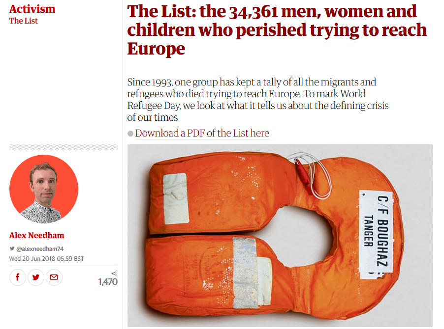

## The-List: 34,361 men, women and children who perished trying to reach Europe

The Guardian has published [this great post](https://www.theguardian.com/world/2018/jun/20/the-list-34361-men-women-and-children-who-perished-trying-to-reach-europe-world-refugee-day) about men, women and children who perished trying to reach Europe. In this post there is a [55 pages PDF](https://uploads.guim.co.uk/2018/06/19/TheList.pdf) report with all the details refugees whose deaths have been reported.

 We have extracted the data from the PDF in CSV format (UTF-8, `,` as separator). The output is the two files in [this folder](data):

 - [refugees and migrants data](data/refugeesAndMigrants.csv);
 - [sources data](data/sources.csv).

The source of the data is [www.unitedagainstracism.org](http://www.unitedagainstracism.org/).

To transform the PDF to CSV files we have created [this script](pdfToCsv.sh).

